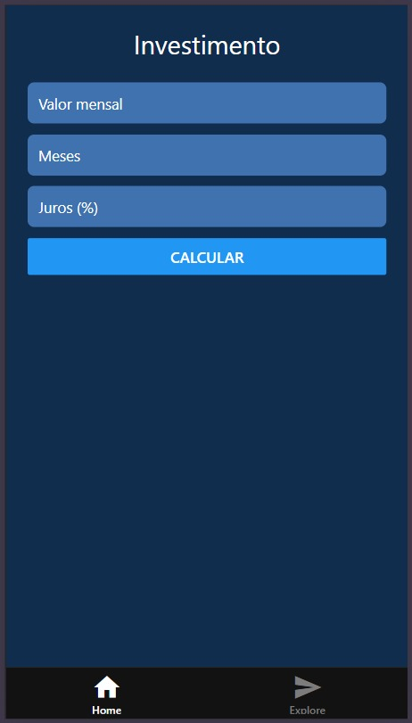

# Investimento Expo App 👋

Exercício aprendendo React Native com Expo

## Para iniciar

1. Instale as dependencias

   ```bash
   npm install
   ```

2. Inicie o app

   ```bash
   npx expo start
   ```



